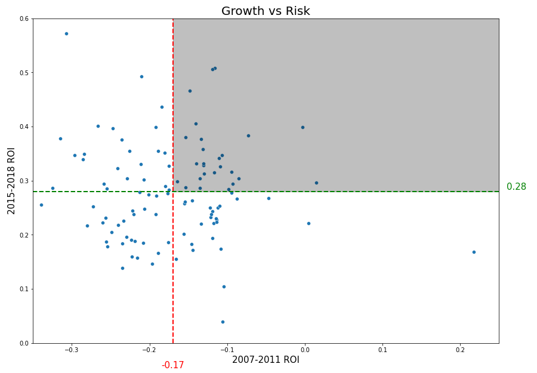

# Forecasting-House-Price-Time-Series

**Authors**: Wesley Yu

## Overview

The aim of this project is to identify the best zipcodes of New York City to invest in. 

To determine the criteria for best investment opportunity, I will examine profit margin of house prices within the last 3 years. Growth will not be the only focus. I will also examine price changes during 2007-2011 period, to assess risk. During this period average house prices dropped sharply due to the subprime mortgage crisis. Zipcodes less affected by this adverse economic event would be deemed less risky.

ARIMA model will be used for time series forecasting, using the below methodology:
* Differencing time series in order to achieve stationarity.
* Examining ACF and PACF plots to determine optimal AR and MA terms.
* Exhaustive search of different combination of terms to find optimal ARIMA model.
* Evaluating model and comparing forecasts with a simple baseline model.

## Business Problem

Identify the 5 best zipcodes in New York City to invest in, excluding Manhattan. Criteria for determining best region will follow:
* High 3 year ROI
* High ROI during 2007-2011
* Forecasting performance compared to baseline model

## Data

Dataset taken from Zillow, provides seasonally adjusted monthly median house prices of various zipcodes from April 1996 to April 2018. Full dataset contains information on 14,723 unique zipcodes.

## Results

Identify criteria for growth and risk. Examining the average house price in NYC area between 1996-2018, we see a period where prices were on the decline during 2007-2011. This can be explained by the subprime mortgage crisis. After 2011 there is a steady incline in house prices. We will measure growth based on the most recent 3 years ROI and risk will be measure based on the ROI during 2007-2011.


Based on the plot of growth and risk we can isolate the top regions that have high growth and low risk.



Top 10 zip codes are identified below having higher than average growth and lower than average risk.


Only 3 models performed better than baseline model. To filter down our selection, I will select models that have the smallest gap between baseline rmse and forecasted rmse.

Based on the following criteria:
* High 3 year ROI
* High ROI during 2007-2011
* Forecasting performance compared to baseline model

The top 5 zipcodes to invest in are:
* 11354
* 11355
* 11694
* 11222
* 11229


Forecast of the top regions for a period of 1 year ahead. As forecast horizon increases, confidence intervals of forecast will also increase. Models can be updated periodically with new observations to keep forecast values as accurate as possible.


## Recommendation

Based on the analysis the top 5 zipcodes to invest in depending on risk level will be:

Low risk:
* 11229 (1 year ROI: 6.4% +/- 0.9%)

Moderate risk:
* 11355 (1 year ROI: 10.5% +/- 7.7%)
* 11354 (1 year ROI: 7.7% +/- 9.6%)

High risk:
* 11694 (1 year ROI: 13.3% +/- 28.7%)
* 11222 (1 year ROI: 18.6% +/- 33.7%)


## Conclusion

### Limitations
Forecasts are based on previous performance . There are many other factors that impact house prices such as GDP, mortgage interest rates, unemployment rates, inflation, and a host of other economic factors. 
 
### Next Steps

Other modeling methods can be test out, such as ARIMAX which can include external factors, such as the ones listed above into the model and improve the quality of forecasts.


## For More Information

Please review our full analysis in [our Jupyter Notebook](./Time_series_analysis.ipynb) or our [presentation]().

For any additional questions, please contact **Wesley Yu at to.wesleyyu@gmail.com**

## Repository Structure

```
├── README.md                           
├── Time_series_analysis.ipynb
├── Presentation.pdf        
├── data                                
└── images                              
```
